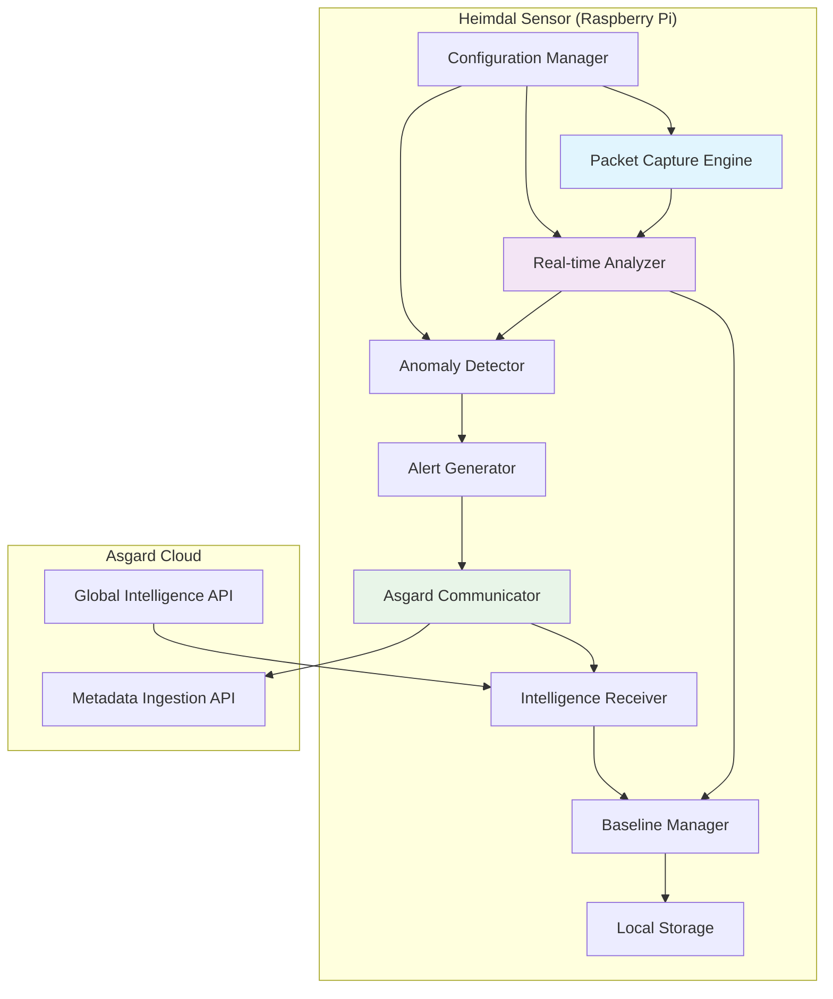
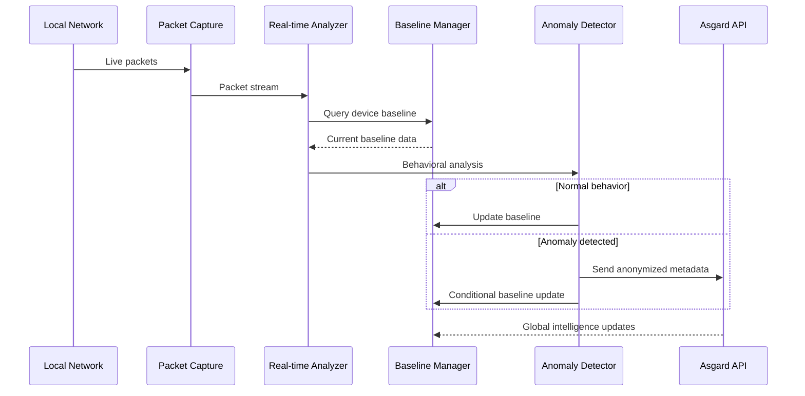

# Design Document: Real-time Network Monitoring

## Overview

The Real-time Network Monitoring feature transforms Heimdal from a static pcap analyzer into a live network monitoring system. This design builds upon the existing Python/scapy foundation while adding real-time packet capture, streaming analysis, and bidirectional communication with the Asgard cloud platform.

The system operates as a continuous monitoring loop: capture live packets → analyze against baselines → detect anomalies → update local baselines → transmit anonymized metadata to Asgard → receive and apply global intelligence updates.

## Architecture

### High-Level Component Architecture



### Data Flow Architecture



## Components and Interfaces

### 1. Packet Capture Engine

**Purpose:** Continuously capture live network packets using ARP spoofing positioning.

**Technology:** Python with scapy for packet capture, threading for non-blocking operation.

**Key Interfaces:**
```python
class PacketCaptureEngine:
    def start_capture(self, interface: str, filter_expression: str = None)
    def stop_capture(self)
    def get_packet_stream(self) -> Iterator[Packet]
    def get_capture_statistics(self) -> CaptureStats
```

**Implementation Details:**
- Uses scapy's `AsyncSniffer` for non-blocking packet capture
- Implements packet buffering to handle burst traffic
- Supports Berkeley Packet Filter (BPF) expressions for traffic filtering
- Maintains capture statistics (packets/sec, drops, errors)

### 2. Real-time Analyzer

**Purpose:** Process live packet stream and extract behavioral features for each device.

**Key Interfaces:**
```python
class RealtimeAnalyzer:
    def process_packet(self, packet: Packet) -> DeviceBehavior
    def extract_device_features(self, packet: Packet) -> DeviceFeatures
    def update_device_activity(self, device_id: str, features: DeviceFeatures)
```

**Behavioral Features Extracted:**
- Connection patterns (new destinations, port usage)
- Traffic volume and timing patterns
- Protocol distribution
- Geolocation of external connections
- DNS query patterns

### 3. Baseline Manager

**Purpose:** Maintain and update behavioral baselines for each device, integrating local learning with global intelligence.

**Key Interfaces:**
```python
class BaselineManager:
    def get_device_baseline(self, device_id: str) -> DeviceBaseline
    def update_baseline(self, device_id: str, new_behavior: DeviceBehavior)
    def integrate_global_profile(self, device_type: str, golden_profile: GoldenProfile)
    def save_baselines(self) -> bool
    def load_baselines(self) -> bool
```

**Baseline Structure:**
```python
@dataclass
class DeviceBaseline:
    device_id: str
    device_type: str
    normal_destinations: Set[str]
    normal_ports: Set[int]
    traffic_patterns: TrafficPattern
    last_updated: datetime
    confidence_score: float
    global_profile_version: str
```

### 4. Anomaly Detector

**Purpose:** Compare current device behavior against baselines and detect anomalies.

**Key Interfaces:**
```python
class AnomalyDetector:
    def detect_anomalies(self, device_id: str, current_behavior: DeviceBehavior) -> List[Anomaly]
    def calculate_anomaly_score(self, baseline: DeviceBaseline, behavior: DeviceBehavior) -> float
    def classify_anomaly_type(self, anomaly: Anomaly) -> AnomalyType
```

**Anomaly Types:**
- New destination connections
- Unusual traffic volume
- Protocol violations
- Timing anomalies
- Geolocation violations

### 5. Asgard Communicator

**Purpose:** Handle bidirectional communication with Asgard cloud platform.

**Key Interfaces:**
```python
class AsgardCommunicator:
    def send_anomaly_metadata(self, anonymized_anomaly: AnonymizedAnomaly) -> bool
    def send_device_metadata(self, anonymized_device: AnonymizedDevice) -> bool
    def receive_intelligence_updates(self) -> List[IntelligenceUpdate]
    def register_sensor(self, sensor_info: SensorInfo) -> str
```

**Data Anonymization:**
- Replace IP addresses with geographic regions
- Replace MAC addresses with device type fingerprints
- Remove any personally identifiable information
- Maintain behavioral patterns while protecting privacy

## Data Models

### Core Data Structures

```python
@dataclass
class DeviceBehavior:
    device_id: str
    timestamp: datetime
    connections: List[Connection]
    traffic_volume: TrafficVolume
    protocols_used: Set[str]
    dns_queries: List[str]

@dataclass
class Anomaly:
    device_id: str
    anomaly_type: AnomalyType
    severity: SeverityLevel
    description: str
    timestamp: datetime
    confidence_score: float
    baseline_deviation: float

@dataclass
class AnonymizedAnomaly:
    device_type: str
    anomaly_type: AnomalyType
    severity: SeverityLevel
    geographic_region: str
    timestamp: datetime
    behavioral_signature: str
```

### Configuration Schema

```python
@dataclass
class MonitoringConfig:
    capture_interface: str
    anomaly_thresholds: Dict[str, float]
    baseline_update_frequency: int  # seconds
    asgard_api_endpoint: str
    asgard_api_key: str
    log_level: str
    max_packet_buffer_size: int
```

## Error Handling

### Packet Capture Errors
- **Network interface unavailable:** Fallback to alternative interfaces, log error
- **Permission denied:** Provide clear instructions for running with appropriate privileges
- **Packet drops:** Implement adaptive buffering and alert on sustained drops

### Asgard Communication Errors
- **API unavailable:** Queue metadata locally with exponential backoff retry
- **Authentication failures:** Log error and attempt to re-register sensor
- **Rate limiting:** Implement request throttling and priority queuing

### Baseline Management Errors
- **Corrupted baseline files:** Rebuild from recent packet history
- **Disk space issues:** Implement automatic cleanup of old baseline data
- **Memory constraints:** Use streaming processing for large baseline updates

## Testing Strategy

### Unit Testing
- **Packet Processing:** Mock packet streams with known behavioral patterns
- **Anomaly Detection:** Test with synthetic anomalies of varying severity
- **Baseline Management:** Verify baseline evolution and global profile integration
- **Data Anonymization:** Ensure no PII leakage in anonymized metadata

### Integration Testing
- **End-to-End Monitoring:** Deploy on test network with controlled device behavior
- **Asgard Communication:** Test with mock Asgard API endpoints
- **Performance Testing:** Validate packet processing latency under load
- **Failure Recovery:** Test system behavior during network outages and restarts

### Performance Benchmarks
- **Packet Processing Rate:** Target 1000+ packets/second on Raspberry Pi 5
- **Memory Usage:** Stay under 512MB RAM usage during normal operation
- **Anomaly Detection Latency:** Alert generation within 5 seconds of detection
- **Baseline Update Frequency:** Process baseline updates every 60 seconds

## Deployment Considerations

### Hardware Requirements
- **Minimum:** Raspberry Pi 4 with 4GB RAM
- **Recommended:** Raspberry Pi 5 with 8GB RAM
- **Storage:** 32GB SD card minimum for baseline storage and logs
- **Network:** Ethernet connection required for ARP spoofing

### Security Considerations
- **Privilege Management:** Run with minimal required network privileges
- **Data Encryption:** Encrypt all communication with Asgard using TLS 1.3
- **Local Data Protection:** Encrypt baseline files and logs at rest
- **API Key Management:** Secure storage and rotation of Asgard API credentials