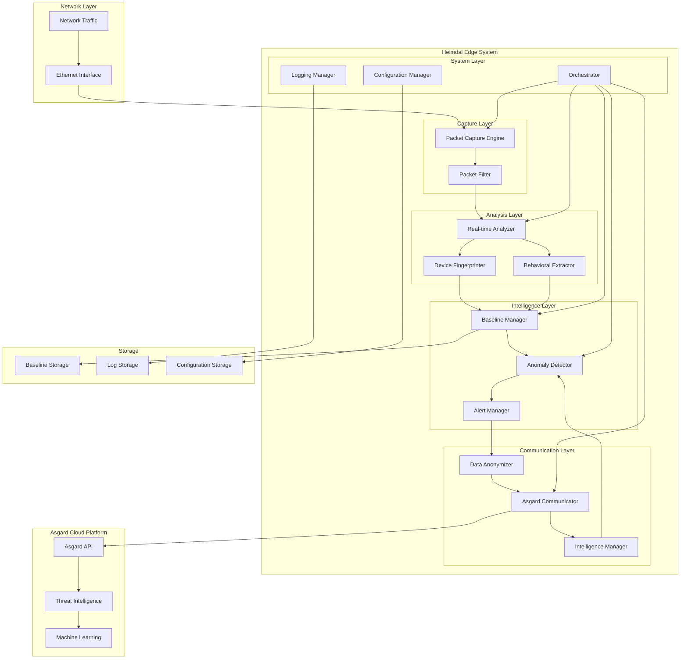
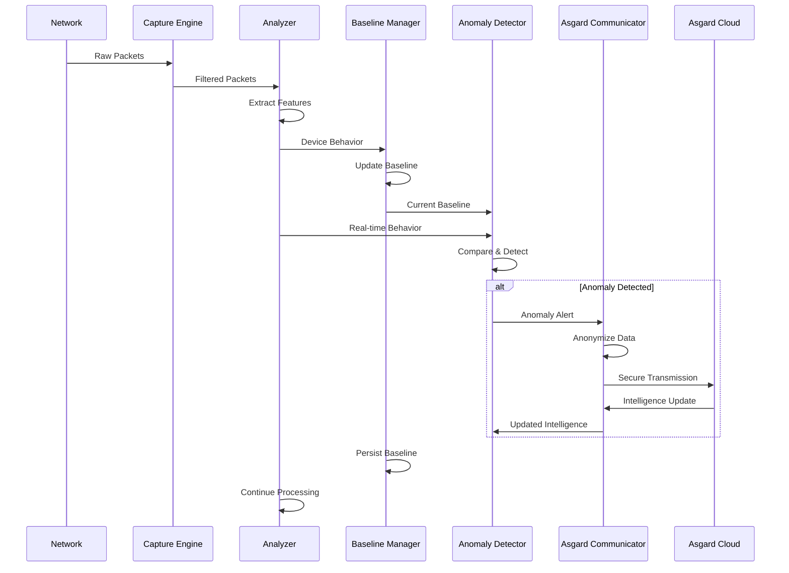
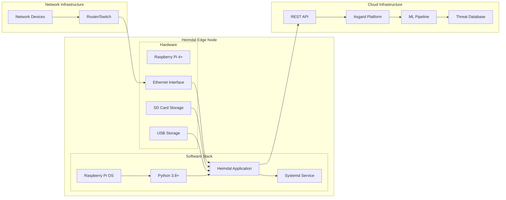
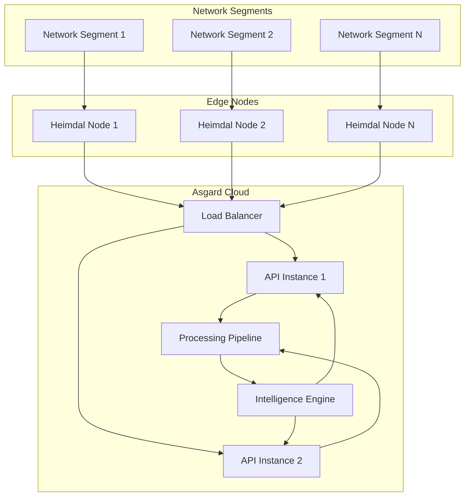

# Heimdal Real-time Network Monitoring System

Heimdal is a real-time network monitoring and anomaly detection system that transforms static pcap file analysis into live network traffic monitoring. As the local edge component of the Cortexa hybrid architecture, Heimdal continuously monitors network behavior, maintains local behavioral baselines, detects anomalies, and forwards anonymized metadata to the Asgard cloud platform for global threat intelligence.

## Project Structure

```
heimdal/
├── heimdal/                    # Main package directory
│   ├── __init__.py
│   ├── main.py                 # Application entry point
│   ├── models.py               # Core data models
│   ├── interfaces.py           # Component interfaces
│   ├── orchestrator.py         # System orchestrator
│   ├── capture/                # Packet capture components
│   │   ├── __init__.py
│   │   └── engine.py           # Packet capture engine
│   ├── analysis/               # Real-time analysis components
│   │   ├── __init__.py
│   │   ├── device_fingerprinter.py
│   │   └── behavioral_extractor.py
│   ├── baseline/               # Baseline management components
│   │   ├── __init__.py
│   │   └── manager.py          # Baseline manager
│   ├── anomaly/                # Anomaly detection components
│   │   ├── __init__.py
│   │   ├── detector.py         # Anomaly detector
│   │   └── alert_manager.py    # Alert management
│   ├── communication/          # Asgard cloud communication
│   │   ├── __init__.py
│   │   ├── asgard_communicator.py
│   │   ├── data_anonymizer.py
│   │   └── intelligence_manager.py
│   ├── config/                 # Configuration management
│   │   ├── __init__.py
│   │   └── manager.py          # Configuration manager
│   └── logging/                # Logging and diagnostics
│       ├── __init__.py
│       ├── manager.py          # Logging manager
│       ├── diagnostics.py      # System diagnostics
│       └── performance_monitor.py
├── scripts/                    # Deployment and maintenance scripts
│   ├── install.sh              # Automated installation
│   ├── uninstall.sh            # System removal
│   ├── raspberry-pi-setup.sh   # Raspberry Pi optimization
│   ├── update-config.sh        # Configuration management
│   ├── health-check.sh         # System health monitoring
│   ├── backup-restore.sh       # Backup and restore
│   ├── heimdal.service         # Systemd service file
│   └── README.md               # Script documentation
├── docs/                       # Documentation
│   ├── DEPLOYMENT.md           # Deployment guide
│   └── QUICK_START.md          # Quick start guide
├── config/                     # Configuration templates
│   ├── heimdal.yaml           # YAML configuration template
│   └── heimdal.json           # JSON configuration template
├── tests/                      # Test suite
│   ├── unit/                   # Unit tests
│   ├── integration/            # Integration tests
│   └── conftest.py            # Test configuration
├── requirements.txt            # Python dependencies
├── setup.py                   # Package setup script
└── README.md                  # This file
```

## Features

- **Real-time Packet Capture**: Continuous monitoring of live network traffic
- **Behavioral Analysis**: Device fingerprinting and behavior pattern extraction
- **Anomaly Detection**: Real-time comparison against learned baselines
- **Cloud Integration**: Bidirectional communication with Asgard platform
- **Data Anonymization**: Privacy-preserving metadata transmission
- **Configurable Thresholds**: Tunable anomaly detection parameters
- **Comprehensive Logging**: Detailed system diagnostics and monitoring

## Installation

Heimdal provides multiple installation methods to support different deployment scenarios.

### Automated Installation (Recommended)

For production deployments on Raspberry Pi or Debian-based systems:

```bash
# Clone the repository
git clone https://github.com/cortexa/heimdal.git
cd heimdal

# Run automated installation
sudo bash scripts/install.sh
```

The automated installer will:
- Install system dependencies
- Create heimdal user and directories
- Set up Python virtual environment
- Configure systemd service
- Set up logging and permissions
- Generate unique sensor ID

### Raspberry Pi Optimization (Optional)

For Raspberry Pi deployments, run the optimization script before installation:

```bash
# Optimize Raspberry Pi for network monitoring
sudo bash scripts/raspberry-pi-setup.sh
sudo reboot

# Then run the main installation
sudo bash scripts/install.sh
```

### Manual Installation

For development or custom deployments:

1. Install Python dependencies:
```bash
pip install -r requirements.txt
```

2. Install the package:
```bash
pip install -e .
```

3. Set up configuration:
```bash
cp config/heimdal.yaml /etc/heimdal/heimdal.yaml
```

### Quick Start

After installation, follow the quick start guide:

```bash
# Configure the system
sudo bash scripts/update-config.sh

# Start the service
sudo systemctl start heimdal

# Check system health
sudo bash scripts/health-check.sh
```

For detailed installation instructions, see [docs/DEPLOYMENT.md](docs/DEPLOYMENT.md) and [docs/QUICK_START.md](docs/QUICK_START.md).

## Configuration

Heimdal supports both YAML and JSON configuration files. Copy and customize one of the templates:

```bash
cp config/heimdal.yaml /etc/heimdal/config.yaml
# or
cp config/heimdal.json /etc/heimdal/config.json
```

Key configuration sections:
- **capture**: Packet capture settings
- **analysis**: Real-time analysis parameters
- **anomaly_detection**: Detection thresholds and algorithms
- **baseline**: Baseline management settings
- **asgard**: Cloud communication configuration
- **logging**: System logging configuration

## Usage

### Command Line

Run Heimdal with default configuration:
```bash
heimdal
```

Run with custom configuration:
```bash
heimdal --config /path/to/config.yaml
```

Validate configuration:
```bash
heimdal --validate-config --config /path/to/config.yaml
```

### Python API

```python
from heimdal.main import HeimdallApplication

# Create and start the application
app = HeimdallApplication("config/heimdal.yaml")
app.start()

# Keep running until stopped
app.run()
```

## Requirements

- Python 3.8 or higher
- Root privileges for packet capture
- Network interface access
- Sufficient disk space for baseline storage and logs

### System Dependencies

- **scapy**: Packet capture and analysis
- **pyyaml**: YAML configuration support
- **requests**: HTTP communication with Asgard
- **python-dateutil**: Date/time handling

### Optional Dependencies

- **psutil**: System performance monitoring
- **geoip2**: IP geolocation (requires MaxMind database)
- **cryptography**: Enhanced security features

## System Architecture

Heimdal implements a sophisticated real-time network monitoring architecture designed for edge deployment with cloud intelligence integration. The system follows a modular, event-driven design that enables scalable and maintainable network security monitoring.

### High-Level Architecture



### Component Architecture

#### 1. Capture Layer
The capture layer handles raw network packet acquisition and initial filtering.

**Packet Capture Engine (`heimdal/capture/engine.py`)**
- Implements real-time packet capture using Scapy
- Supports configurable network interfaces and BPF filters
- Manages packet buffering and flow control
- Handles capture errors and interface monitoring

**Key Features:**
- Non-blocking packet capture with configurable timeouts
- Automatic interface detection and validation
- Packet buffer management with overflow protection
- Support for promiscuous mode and custom filters

#### 2. Analysis Layer
The analysis layer processes captured packets to extract behavioral features and device characteristics.

**Real-time Analyzer**
- Coordinates packet processing pipeline
- Manages analysis batching and timing
- Handles device session tracking
- Implements feature extraction orchestration

**Device Fingerprinter (`heimdal/analysis/device_fingerprinter.py`)**
- Extracts device characteristics from network traffic
- Identifies device types, operating systems, and applications
- Maintains device identity consistency across sessions
- Supports passive fingerprinting techniques

**Behavioral Extractor (`heimdal/analysis/behavioral_extractor.py`)**
- Extracts behavioral patterns from network communications
- Analyzes traffic timing, volume, and protocol usage
- Identifies communication patterns and destinations
- Generates behavioral feature vectors

#### 3. Intelligence Layer
The intelligence layer implements anomaly detection and baseline management.

**Baseline Manager (`heimdal/baseline/manager.py`)**
- Maintains behavioral baselines for each monitored device
- Implements adaptive learning algorithms
- Manages baseline persistence and versioning
- Handles baseline aging and cleanup

**Anomaly Detector (`heimdal/anomaly/detector.py`)**
- Compares real-time behavior against established baselines
- Implements multiple anomaly detection algorithms
- Manages detection thresholds and sensitivity
- Correlates related anomalies across time windows

**Alert Manager (`heimdal/anomaly/alert_manager.py`)**
- Processes and prioritizes detected anomalies
- Implements alert correlation and deduplication
- Manages alert lifecycle and acknowledgment
- Formats alerts for local and cloud consumption

#### 4. Communication Layer
The communication layer handles secure data transmission to the Asgard cloud platform.

**Data Anonymizer (`heimdal/communication/data_anonymizer.py`)**
- Anonymizes sensitive data before cloud transmission
- Implements privacy-preserving data transformation
- Maintains data utility while protecting privacy
- Supports configurable anonymization policies

**Asgard Communicator (`heimdal/communication/asgard_communicator.py`)**
- Manages bidirectional communication with Asgard API
- Implements secure authentication and encryption
- Handles connection management and retry logic
- Manages data queuing and transmission scheduling

**Intelligence Manager (`heimdal/communication/intelligence_manager.py`)**
- Processes threat intelligence updates from Asgard
- Integrates cloud intelligence with local detection
- Manages intelligence feed subscriptions
- Handles intelligence data validation and application

#### 5. System Layer
The system layer provides core infrastructure and management capabilities.

**Orchestrator (`heimdal/orchestrator.py`)**
- Coordinates all system components
- Manages component lifecycle and dependencies
- Implements system startup and shutdown procedures
- Handles error recovery and system health monitoring

**Configuration Manager (`heimdal/config/manager.py`)**
- Manages system configuration loading and validation
- Supports multiple configuration formats (YAML, JSON)
- Implements configuration change detection and reloading
- Provides configuration access interface for all components

**Logging Manager (`heimdal/logging/manager.py`)**
- Provides centralized logging infrastructure
- Implements structured logging with correlation IDs
- Manages log levels, formatting, and rotation
- Supports performance monitoring and diagnostics

### Data Flow Architecture



### Deployment Architecture

#### Edge Deployment
Heimdal is designed for deployment on edge devices, particularly Raspberry Pi systems:



#### Scalability Architecture
The system supports horizontal scaling through multiple edge nodes:



### Security Architecture

#### Data Protection
- **Local Processing**: Sensitive data remains on edge device
- **Anonymization**: PII removed before cloud transmission
- **Encryption**: All cloud communications use TLS 1.3
- **Authentication**: API key-based authentication with rotation support

#### System Security
- **Privilege Separation**: Runs as non-root user with minimal capabilities
- **Sandboxing**: Systemd security features limit system access
- **Network Isolation**: Only required network access permitted
- **Audit Logging**: Comprehensive security event logging

### Performance Architecture

#### Real-time Processing
- **Streaming Pipeline**: Continuous packet processing without buffering delays
- **Adaptive Batching**: Dynamic batch sizing based on traffic volume
- **Memory Management**: Bounded memory usage with overflow protection
- **CPU Optimization**: Multi-threaded processing where beneficial

#### Resource Management
- **Configurable Limits**: Tunable resource consumption parameters
- **Graceful Degradation**: Maintains core functionality under resource pressure
- **Performance Monitoring**: Built-in performance metrics and alerting
- **Auto-scaling**: Adaptive processing based on system load

### Integration Architecture

#### Configuration Management
- **Multiple Formats**: Support for YAML and JSON configuration
- **Hot Reloading**: Configuration changes without service restart
- **Validation**: Comprehensive configuration validation
- **Templating**: Environment-specific configuration templates

#### Monitoring and Observability
- **Structured Logging**: JSON-formatted logs with correlation IDs
- **Metrics Collection**: Performance and operational metrics
- **Health Checks**: Comprehensive system health monitoring
- **Diagnostics**: Built-in diagnostic and troubleshooting tools

This architecture ensures Heimdal can effectively monitor network traffic in real-time while maintaining security, performance, and scalability requirements for edge deployment scenarios.

## Deployment and Maintenance

Heimdal includes comprehensive deployment and maintenance tools for production environments.

### Deployment Scripts

- **`scripts/install.sh`** - Automated installation for Debian-based systems
- **`scripts/raspberry-pi-setup.sh`** - Raspberry Pi specific optimizations
- **`scripts/uninstall.sh`** - Complete system removal

### Configuration Management

- **`scripts/update-config.sh`** - Interactive configuration management
- **Configuration validation** - Built-in configuration syntax checking
- **Hot reloading** - Configuration updates without service restart

### System Monitoring

- **`scripts/health-check.sh`** - Comprehensive system health monitoring
- **Performance monitoring** - Built-in performance metrics and alerting
- **Log management** - Automated log rotation and analysis

### Backup and Recovery

- **`scripts/backup-restore.sh`** - Complete backup and restore functionality
- **Automated backups** - Configurable backup scheduling
- **Selective restore** - Granular restore options

### Service Management

Heimdal runs as a systemd service with:
- **Automatic startup** - Starts on system boot
- **Failure recovery** - Automatic restart on failure
- **Security hardening** - Runs with minimal privileges
- **Resource limits** - Configurable resource constraints

### Monitoring Commands

```bash
# Check service status
sudo systemctl status heimdal

# View real-time logs
sudo journalctl -u heimdal -f

# Run health check
sudo bash scripts/health-check.sh

# Update configuration
sudo bash scripts/update-config.sh

# Create backup
sudo bash scripts/backup-restore.sh create
```

## Development Status

This project is currently in development. The core interfaces and data models have been established, and individual components are being implemented according to the specification. The deployment infrastructure is complete and ready for production use.

## License

MIT License - see LICENSE file for details.

## Support

For support and documentation, visit: https://docs.cortexa.ai/heimdal